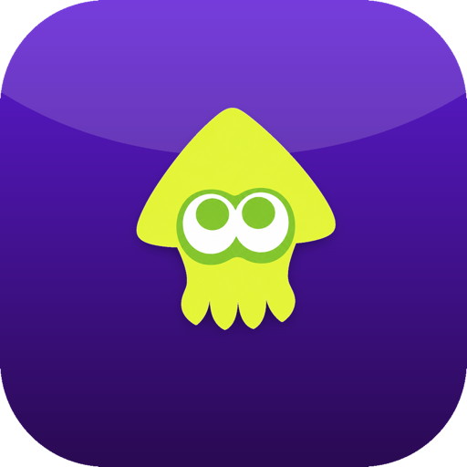
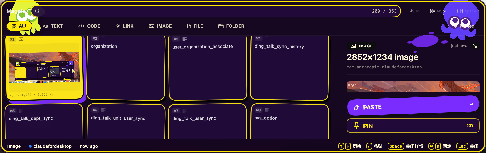
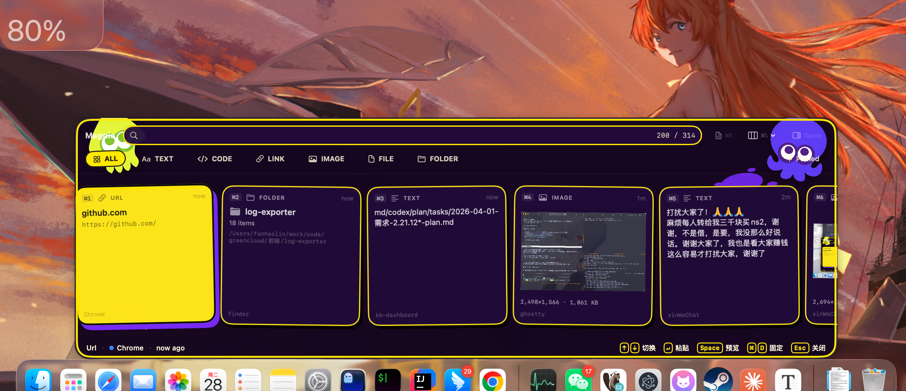

<div align="center">



# Magpie

**本地优先、键盘驱动的 macOS 剪切板管理器**
*A local-first, keyboard-driven clipboard manager for macOS*

[](LICENSE)
[](#)
[](#)
[](#)
[](#)

像喜鹊收集闪亮的小东西一样 — 自动收下你复制的一切，按一下键召出来，再按一下贴出去。

</div>

---

## ✨ 截图

> **⌘P** 召出面板，⌘1–⌘9 / ↩ 一键贴回前台 app。Splat 主题（黄绿章鱼吉祥物 + 紫色墨点装饰）让你忘不掉它。

<p align="center">
  
  <br/>
  <em>Splat dark：粗黄外框 + 紫色面板 + 章鱼角落装饰</em>
</p>

<p align="center">
  
  <br/>
  <em>Stripe 布局 + Detail Pane（按 Space 召出，霓虹高亮选中卡片）</em>
</p>

---

## 为什么用 Magpie

设计目标是**替代 Maccy + Deck**，把"剪切板历史"和"代码片段"做在同一个面板里：

- 🔒 **纯本地** —— SQLite 落盘，永不联网，永不上传，永不分析
- ⌨️ **键盘是一等公民** —— 任何鼠标可达功能都有快捷键
- 🎨 **6 种内容类型** —— text / code / url / image / file / folder 各有专属预览
- 🪟 **3 种布局** —— Stripe（横向卡片） / Stack（紧凑列表） / Grid（瓷砖墙）
- 🔍 **FTS5 全文搜索** —— 支持 `type:code app:vscode tag:design` 这种 key:value 语法
- 📌 **Pin / Snippets / Queue Mode** —— 钉常用、存模板、批量贴
- 🔐 **Touch ID 隐私门** —— 召出面板前指纹解锁（可选）
- 🚫 **Secret 自动跳过** —— API key / Bearer token / JWT / OTP 不入库
- 🎭 **5 种主题** —— mono / graphite / blue / olive 走系统简约；**Splat** 走 Splatoon 灵感的紫黄装饰风
- 🌐 **中英文界面** —— Settings 一键切换

---

## 📦 下载安装

### 推荐：直接装 DMG

下载最新 Release：[`dist/Magpie-0.3.0.dmg`](dist/Magpie-0.3.0.dmg)（4.4 MB）

```bash
# 拖进 /Applications
open dist/Magpie-0.3.0.dmg
```

> **首次启动**：macOS 会因为 ad-hoc 签名提示"无法验证开发者"。
> 在 Finder 里**右键 .app → 打开**确认一次即可，之后双击就能开。
> v1.0 会换正式 Apple Developer ID 签名，届时双击直接开。

### 给予权限

Magpie 需要两个权限才能完整工作：

| 权限 | 用途 | 怎么开 |
|---|---|---|
| **辅助功能** | 模拟 ⌘V 把 clip 贴回前台 app | 系统设置 → 隐私与安全性 → 辅助功能 → 添加 Magpie |
| **输入监控**（可选） | `;sig` 之类的片段触发器自动展开 | 系统设置 → 隐私与安全性 → 输入监控 → 添加 Magpie；并在 Magpie 设置里打开 *Auto-expand snippet shortcuts* |

第一次启动如果没批准辅助功能，Magpie 会自动弹系统对话框引导。

---

## ⌨️ 快捷键

### 全局

| 快捷键 | 行为 |
|---|---|
| `⌘P` | 召出 / 收起 主面板 |
| `Esc` | 收回面板（搜索框非空时先清搜索） |

### 面板内

| 快捷键 | 行为 |
|---|---|
| `↑` `↓` `←` `→` | 切换焦点卡片 |
| `↩` | 粘贴 focused clip |
| `⌘1` … `⌘9` | 直接粘贴第 1–9 张 |
| `Space` | 开 / 关 Detail Pane（搜索为空时） |
| `⌘O` | 把 focused clip 在独立大窗口里放大查看 |
| `⌘D` | Pin / Unpin focused clip |
| `⌘\` | 切换布局（Stripe → Stack → Grid） |
| `⌘S` | 开 / 关 Snippets 抽屉 |
| `⌘Q` | 进入 / 退出 Queue Mode |
| `⌘,` | 打开 Settings |

---

## 🎨 主题

5 种 flavor，每种都有 light/dark 两套 token：

| Flavor | 风格 | 用途 |
|---|---|---|
| **Mono** | 纯灰 | 极简党，跟 Finder 一个气质 |
| **Graphite** | 石墨灰 | 比 Mono 多一点点层次 |
| **Blue** | 海军蓝 | 经典 Aqua |
| **Olive** | 橄榄绿 | 自然柔和 |
| **Splat** ⭐ | Splatoon 致敬 — 黄绿章鱼 + 紫色墨点 | 装饰主题，看一眼就忘不掉 |

Settings → 通用 → 风格 切换。还能调毛玻璃强度和**面板透明度**（0.6–1.0）。

---

## 🔐 隐私

Magpie 设计上就是**永不联网**：

- ❌ 没有任何分析 / 遥测 / 崩溃上报代码
- ❌ 没有云同步、登录、账号系统
- ❌ Settings 里的 *Send analytics* 开关**永远不可启用**（占位提示文案而已）
- ✅ 所有数据落 `~/Library/Application Support/Magpie/clips.sqlite`
- ✅ 启动可选 Touch ID 解锁
- ✅ Secret 模式自动跳过 8 类敏感字符串（API key / Bearer / GitHub token / AWS / JWT / OTP 等）
- ✅ 用户可指定"忽略的应用"（这些 app 复制的内容永不入库）
- ✅ History retention 设置（保留 N 天 / 限制条数 / 一键清空）

> v1.0 会加 **SQLCipher 加密本地数据库**，密钥存 macOS Keychain。

---

## 🛠️ 从源码构建

需要：

- macOS 14 (Sonoma) 或更高
- 完整 Xcode 15+（仅 Command Line Tools 不够）
- [XcodeGen](https://github.com/yonaskolb/XcodeGen)（用 `brew install xcodegen` 安装）

```bash
git clone https://github.com/sanwan99/magpie.git
cd magpie
xcodegen generate          # 从 project.yml 生成 Magpie.xcodeproj
xcodebuild -project Magpie.xcodeproj -scheme Magpie -configuration Debug build
open build/Build/Products/Debug/Magpie.app
```

依赖（SPM 自动拉取）：

- [HotKey](https://github.com/soffes/HotKey) — 全局热键 ⌘P
- [GRDB.swift](https://github.com/groue/GRDB.swift) — SQLite ORM + FTS5

---

## 🧪 测试

```bash
xcodebuild -project Magpie.xcodeproj -scheme Magpie test
```

当前 **82 个 XCTest 单元测试**：

- `SecretDetectorTests` — 27 个（8 种 secret 模式 + 阴性样本）
- `SnippetRepositoryTests` — 10 个（CRUD + 触发器索引）
- `HistoryReaperTests` — 7 个（retention + maxItems + clear all）
- 其他模块 — 38 个（ClipDetector / SearchQueryParser / ClipboardWatcher 等）

---

## 🗺️ Roadmap

| 版本 | 状态 | 范围 |
|---|---|---|
| v0.1 | ✅ 已发布 | 剪切板监听、⌘P 面板、Stripe 布局、↵/双击粘贴、4 种类型 |
| v0.2 | ✅ 已发布 | 搜索（FTS5 + key:value 语法）、类型过滤、Pin、Stack & Grid、Detail Pane、Settings |
| v0.3 | ✅ 已发布 | Image 类型、Snippets 抽屉 + 编辑器、History/Privacy/Queue Mode、ColorScheme-aware Splat dark |
| **v0.3-d 系列** | ✅ 已发布 | 装饰元素（squid + 墨点）、霓虹选中态、面板透明度、放大预览窗口（⌘O）、菜单栏图标 + sleep/wake/Space 切换 hotkey 自愈、粘贴去重 upsert、AX 权限自检 |
| **v1.0** | 进行中 | Sparkle EdDSA 自动更新、SQLCipher 加密、PasteToast 动画、ClipPreview hover 过渡、Apple Developer ID 签名、Homebrew Cask、公开仓库 |
| Later | — | 正则搜索、URL 跟踪参数清理、CLI 工具、`;sig` CGEventTap 升级、第三方 Sync 插件接口 |

---

## 📁 项目结构

```
magpie/
├── Magpie.xcodeproj/           # Xcode 工程（xcodegen 生成）
├── project.yml                 # XcodeGen 项目定义
├── Sources/Magpie/
│   ├── App/                    # AppDelegate、StatusItemController（菜单栏）
│   ├── Panel/                  # PanelController、PanelWindow（NSPanel 主面板）
│   ├── Clipboard/              # ClipboardWatcher、ClipDetector（类型识别）
│   ├── Storage/                # GRDB schema + ClipRepository（FTS5 + upsert 去重）
│   ├── Paste/                  # FrontmostTracker + Paster（CGEvent ⌘V 模拟）
│   ├── Hotkey/                 # HotkeyCenter（Carbon RegisterEventHotKey）
│   ├── Snippets/               # 片段管理 + ;sig 自动展开
│   ├── Privacy/                # SecretDetector + BiometricGate (Touch ID)
│   ├── History/                # HistoryReaper（retention + 清理）
│   ├── Settings/               # SettingsStore + 4 个 Pane（中英文 i18n）
│   ├── Theme/                  # AppTheme + Flavor + SplatDecorations（自绘装饰）
│   └── UI/                     # ClipPreview、Stripe/Stack/Grid、DetailPane、ExpandedPreviewWindow
├── Resources/
│   ├── Info.plist
│   └── Assets.xcassets/        # AppIcon、SquidYellow、SquidPurple
├── Tests/MagpieTests/          # XCTest 单元测试
├── prototype/                  # 原始 React/JSX 视觉原型 + 13 节产品规格说明（设计依据，仅参考）
├── md/                         # 任务计划 / changelog / ADR / 月度台账（软链到私人 notes 仓）
└── dist/                       # DMG release 产物
```

---

## 🤝 Contributing

Pull requests welcome. 详见 [CONTRIBUTING.md](CONTRIBUTING.md)。

提 PR 前请先看 [`prototype/剪切板工具/Magpie 原型说明.html`](prototype/) — 那是 13 节完整产品规格的事实标准，任何交互/键位/视觉/命名隐喻的争议都以它为准。

发现安全问题？请按 [SECURITY.md](SECURITY.md) 流程提交。

---

## 📜 License

[MIT](LICENSE) © 2026 sanwan99 and Magpie contributors

---

## 🙏 致谢

- 灵感来自 [Maccy](https://github.com/p0deje/Maccy)、[Raycast Clipboard](https://www.raycast.com)、Deck
- Splat 主题致敬任天堂 *Splatoon* — Inkling / Octoling 的喷射美学
